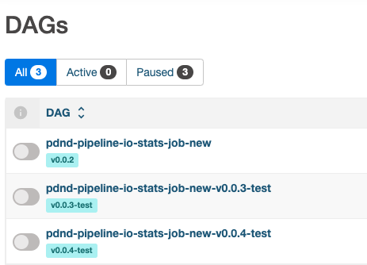

# deploy-airflow-dags
This action is an internal custom solution that allows to deploy dags to an internal Airflow instance (`airflow-data` or `airflow-infra`). <br>
Specs:
- an essential prerequisite is the existence of a folder (i.e. `/dags`) inside the project repo to be deployed containing all the Python files describing the Airflow dags
- the deploy consists in copying the above Python files to a .zip file named as `<project-repo-name>.zip` shared on a Kubernetes volume claim
- the volume claim must already be mounted on the runner on which the action will be triggered (see [deploy-gh-runner-action](..//deploy-gh-runner/action.yml) and [deploy-gh-runner-entrypoint](../deploy-gh-runner/entrypoint.sh))
- the action does not use Airflow APIs for deploying and updating dags but only for internal checks, stopping and restarting dags
- the action checks the input version:
  - `vx.x.x` format is meant for production releases:
    - in this case the `<project-repo-name>.zip` file will be overwritten
    - production dags will be named as `<project-repo-name>-<dag-name>`
  - `vx.x.x-test`, `vx.x.x-beta`, `vx.x.x-dev` formats are meant for testing puroposes:
    - in this other case a new `<project-repo-name>-<version>.zip` file will be created
    - test dags will be named as `<project-repo-name>-<dag-name>-<version>`

## Inputs

|                          |              |                                                                              |
|--------------------------|--------------|------------------------------------------------------------------------------|
| project                  | **required** | Name of the project  repo                                                    |
| version                  | **required** | Release version of the project repo                                          |
| airflow_api_url          | **required** | Airflow instance Api url                                                     |
| airflow_username         | **required** | Airflow instance username                                                    |
| airflow_password         | **required** | Airflow instance password                                                    |
| airflow_dags_folder_path |              | Airflow dags folder path (default is `dags`)                                 |
| airflow_dags_volume_path | **required** | Airflow dags volume mount path (`airflow-data-dags` or `airflow-infra-dags`) |

## Example usage
```
uses: pagopa/pdnd-github-actions/deploy-airflow-dags@vx.x.x
with:
  project: pdnd-pipeline-io-stats
  version: v1.0.0
  airflow_api_url: ***
  airflow_username: ***
  airflow_password: ***
  airflow_dags_volume_path: /mnt/efs/airflow-data-dags
```

## Example output
Dags from the Airflow UI:

